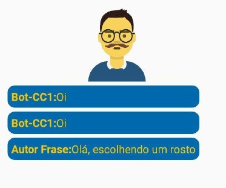

# CWG Chat-CC1


### Instalação
Adicione o pacote ao seu projeto: 
```
npm i cwg-rn-chatbot
```

Após intalado, basta importar o pacote:
```typescript
import { Chatbot } from 'cwg-rn-chatbot';
```

### Utilizando 


Comando básico em funções:

```typescript
export default function App() {
  //Aponta a referência
  const chatRef = React.createRef<Chatbot>()

  useEffect(() => {
    //Exibe a fala do Chat
    const init = async () => {
        await chatRef.current?.falar('Olá');
        await chatRef.current?.falar('Me chato Bot-CC1', 'Bot-CC1');
    }

    init()
  }, [])

  return (
    <View>
      <Chatbot ref={chatRef}/>
    </View>
  );
};
```


Comando básico em uma classe:
```typescript
export default class ClasseScreen extends React.Component<ClasseScreenProps, ClasseScreenState> {
  
    //Cria um componente de referência para acessar o chat
    protected chatRef: React.RefObject<Chatbot>;
  
    constructor(props: ClasseScreenProps) {
        super(props);
        this.state = {
        };
        this.chatRef = React.createRef<Chatbot>();
    }

    //Caso seja uma Classe Componente, realiza suas ações iniciais no componentDidMount
    async componentDidMount() {
        await this.chatRef.current?.falar('Você chegou na nova tela');
    }

    public render() {
        return (
        <View>
            <Text>ClasseScreen Component</Text>
            <Chatbot ref={this.chatRef}/>
        </View>
        );
    }
}
```
---------------------


Adicionando botões de interação:
```typescript
//Apenas a Fala e mantendo o rosto antigo
await chatRef.current?.falar('oi')

//Fala e alterando o rosto do chatbot
await chatRef.current?.falar('oi', BotFaces.FELIZ)

//Fala, alterando o rosto do chatbot e o nome de quem fala
await chatRef.current?.falar('Olá, escolhendo um rosto', BotFaces.SERIO, 'Autor Frase')

await chatRef.current?.falar('Rosto próprio', require('./image-propria.jpg'))


```

principais comandos de fala:
| Paramêtro | Conteúdo                                                                                                                                     | OPCIONAL          |
|-----------|----------------------------------------------------------------------------------------------------------------------------------------------|-------------------|
| mensagem  | Mensagem que será exibida                                                                                                                    | OBRIGATÓRIO       |
| botFace   | Rosto do chatbot. Pode usar um dos rosto do BotFaces ou importar uma imagem própria com require. Caso não passe nada, manterá o rosto antigo | SIM               |
| autor     | Nome que será exibida ao autor da mensagem. Caso nõa informe, o nome padrão será Bot-CC1                                                     | SIM               |
| bot       | Se a mensagem foi gerada pelo Bot ou usuário. Caso não informe o padrão é do Bot                                                             | SIM (Padrão bot)  |
| delay     | Quanto tempo que demora entre uma mensagem e outra ser exibida. Para o delay funciona a função deve usar um await no inicio.                 | SIM (Padrão 1000) |

---------

#### Interagindo

A interação pode ocorrer através de botões ou campo de texto, através do método interagir. 

Ao interagir com a opção "botoes", deverá ser passado um Opcao[] onde cada opção deve conter o texto do botão e a função que será executada ao clicar nele

```typescript
chatRef.current?.falar('Escolha uma opção')

chatRef.current?.interagir('botoes', [
    new Opcao('Opção 1', () => chatRef.current?.falar('Clicou na opção 1')),
    new Opcao('Opção 2', () => console.log('Opção 2')),
    new Opcao('Opção 3', () => navigation.navigate('home')),
], BotFaces.ESPANTADO)
```


Também é possível realizar uma interação por um campo digitável com a opção texto

```typescript
chatRef.current?.falar('Como você se chama?')
  
chatRef.current?.interagir('texto', async (texto:string) => {
    await chatRef.current?.falar('Eu me chamo ' + texto, null, 'Você: ', false)
    await chatRef.current?.falar('Olá ' + texto)

    await chatRef.current?.interagir('texto', (idade:number) => console.log(idade))
} )
```


| Paramêtro | Conteúdo                                                                         | OPCIONAL    |
|-----------|----------------------------------------------------------------------------------|-------------|
| tipo      | "texto" ou "botoes"                                                              | OBRIGATÓRIO |
| funcoes   | Caso tipo == "texto", passar uma função. Caso tipo == "botoes" passar um Opcao[] | OBRIGATÓRIO |
| botFaces  | Define o rosto do bot. Caso nada seja passado, manterá o rosto antigo            | SIM         |


-----------
License: MIT

Autor: Carlos W. Gama